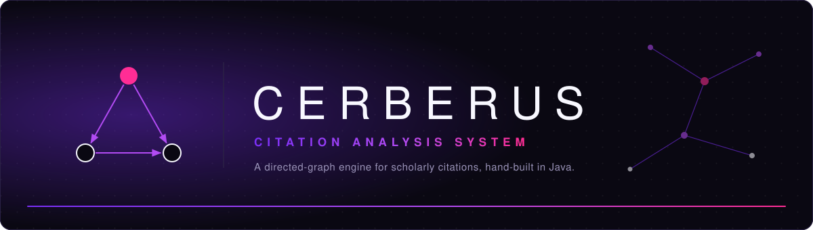
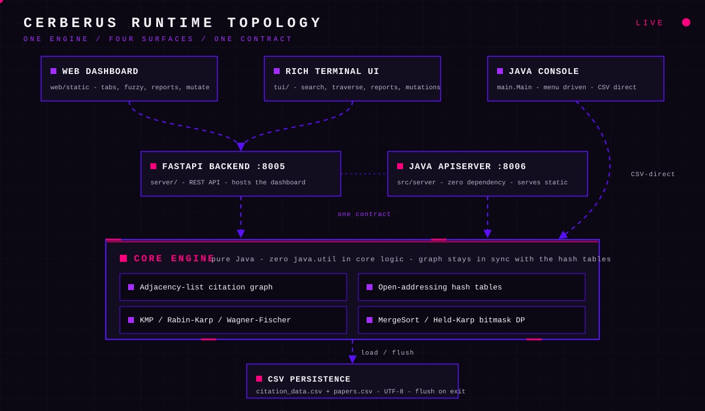
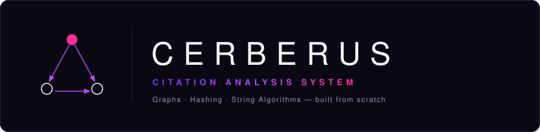

<p align="center">
  
</p>

<p align="center">
  
  
  
  
  
</p>

<p align="center">
  <a href="#overview">Overview</a> &nbsp;|&nbsp;
  <a href="#capabilities">Capabilities</a> &nbsp;|&nbsp;
  <a href="#interfaces">Interfaces</a> &nbsp;|&nbsp;
  <a href="#architecture">Architecture</a> &nbsp;|&nbsp;
  <a href="#complexity">Complexity</a> &nbsp;|&nbsp;
  <a href="#getting-started">Getting Started</a> &nbsp;|&nbsp;
  <a href="#testing">Testing</a> &nbsp;|&nbsp;
  <a href="#roadmap">Roadmap</a> &nbsp;|&nbsp;
  <a href="#team">Team</a>
</p>

<br>

<h3 align="center">Every paper is a vertex. Every citation is a directed edge.</h3>

<p align="center">
Cerberus models scholarly literature as a directed citation graph, then answers the questions researchers actually ask:<br>
who cites whom, which work carries influence, and how an idea travels from one paper to the next.<br>
One engine, four surfaces: a Python REST backend, a Rich terminal UI, a web dashboard and the original Java console.<br>
Every graph, hash table and search routine is written by hand. No <code>java.util</code> collections. No frameworks in the core.
</p>


## Overview

Research literature grows as a web of citations, yet tracking that web is still mostly manual. Relationships live in siloed databases and spreadsheets, influential papers hide behind scattered counts, and teams end up repeating work that already exists.

Cerberus replaces that with one structure you can query. Papers become vertices, citations become directed edges, and classic graph, hashing and string algorithms turn the result into a navigable network.

| In the literature | In the graph |
| :--- | :--- |
| A research paper | A vertex |
| Paper A cites Paper B | A directed edge from A to B |
| A highly cited paper | A vertex with high in-degree |

> [!IMPORTANT]
> Built from first principles. The graph, the hash tables and every search and sort routine are implemented from scratch, with no `java.util` collection classes in the core logic. That constraint is the point of the project.


## Capabilities

| Capability | Implementation |
| :--- | :--- |
| Register papers and record citations | Custom **adjacency-list graph**, plus in-memory mutations over the API |
| Trace citation relationships | **Level-wise horizon** and **deep lineage** traversal, BFS and DFS visit order |
| Look up papers by title or author | Custom **open-addressing hash tables**, O(1) average |
| Search through typos | **Wagner-Fischer** edit distance |
| Match exact patterns | **KMP** and **Rabin-Karp** |
| Route between papers | BFS shortest path, all simple paths, **Held-Karp bitmask** optimal route |
| Rank and report | Custom sorting: top authors, most-cited papers, yearly citation trends |
| Read the source paper | Per-paper viewer: the PDF from `research_papers/` inline, or its text record |


## Interfaces

One engine, four surfaces. Two terminals and a browser cover the full workflow; each surface speaks the same REST contract or reads the same CSV directly.

### 1. API backend — terminal one

```bash
pip install -r requirements.txt
python -m uvicorn server.main:app --port 8005
```

Serves the REST API and hosts the web dashboard at `http://127.0.0.1:8005/`. The dataset loads from `citation_data.csv` on boot; `POST /api/reload` re-reads it.

### 2. Rich terminal UI — terminal two

```bash
PYTHONIOENCODING=utf-8 python -m tui.main
```

With the backend running: exact and fuzzy search, shortest path / optimal route / lineage, BFS and DFS traversal, top-author and trend reports, and live add-paper / add-citation commands. Set `CERBERUS_API_URL` to point it at a different backend.

### 3. Web dashboard — browser

Start the backend, then open `http://127.0.0.1:8005/`.

| View | What it shows |
| :--- | :--- |
| Graph | Live metrics, most-cited table, citation lineage |
| Search | Exact (KMP) or typo-tolerant (Wagner–Fischer) results |
| Traversal | BFS/DFS visit order, shortest path, bitmask-optimal route |
| Reports | Top authors and yearly citation trends |
| Manage | Add papers and citation edges; errors surface in the status line |

Every paper row links to its own document. Clicking one opens `#/paper/<id>`: a
restrained viewer with the paper's metadata, citation links and either the PDF
from `research_papers/` (embedded inline) or, when no PDF ships, the paper's
text record. The algorithm used for a result is named in that result's own
header — the dashboard never advertises complexity numbers as decoration.

### Alternate surfaces

```bash
java -cp out main.Main           # original menu-driven console, reads citation_data.csv directly
java -cp out main.Main --serve   # pure-Java REST server + dashboard on port 8006 (override: --serve 9000)
```

The Java server needs no Python at all: JDK `com.sun.net.httpserver` only. Mutations are in-memory and the graph is flushed back to `citation_data.csv` as UTF-8 on Ctrl+C.

### API contract

| Route | Purpose |
| :--- | :--- |
| `GET /api/papers?q=&limit=&fuzzy=` | List or search papers |
| `GET /api/papers/{id}` | Paper detail with in/out citation edges and document availability |
| `GET /api/papers/{id}/document?format=pdf\|text` | The paper's own file from `research_papers/` |
| `GET /api/traverse?source=&mode=bfs\|dfs` | Visit order from a paper |
| `GET /api/reports/authors` and `/api/reports/trends` | Ranked reports |
| `GET /api/path`, `/api/paths`, `/api/optimal-route`, `/api/lineage` | Routing and reachability |
| `POST /api/papers`, `POST /api/citations` | In-memory mutations |
| `GET /api/health`, `GET /api/stats`, `POST /api/reload` | Status and CSV reload |

The pure-Java server mirrors this contract; reports live at `GET /api/report?type=top-authors|top-papers|trends`. It does not serve paper documents, so the viewer's document step degrades to a clear message on that surface.


## Configuration

The backend reads its paths and CORS policy from the environment:

| Variable | Default | Purpose |
| :--- | :--- | :--- |
| `CERBERUS_CSV` | `citation_data.csv` | Dataset path |
| `CERBERUS_PAPERS_DIR` | `research_papers/` | Paper corpus directory |
| `CERBERUS_CORS_ORIGINS` | `*` | Comma-separated allowed browser origins |

The dashboard resolves its API base without a hardcoded developer host. First
match wins:

| Order | Source | Use |
| :--- | :--- | :--- |
| 1 | `?api=<url>` | One-off testing |
| 2 | `localStorage['cerberusApiBase']` | Per-browser override (Connection help in the footer) |
| 3 | `window.CERBERUS_API_URL` in `web/static/config.js` | Deploy-time configuration |
| 4 | the page's own origin | Default: the API serves the dashboard |
| 5 | `http://127.0.0.1:8005` | Fallback when opened from `file://` |

So local development and a single-service deploy need no configuration at all.
When the dashboard is hosted separately from the API, set `CERBERUS_API_URL` in
`config.js` to the deployed backend origin **and** set `CERBERUS_CORS_ORIGINS` on
the backend to that same origin. Nothing is hardcoded, and a placeholder URL is
never substituted — if the backend is not reachable the footer says so and links
to the connection help.


## Architecture

<p align="center">
  
</p>

The diagram runs live: dashes travel along every connector, Laser Pink packets carry requests from surface to API to engine, a scanline sweeps the core, and the exit node pulses. It maps the same path a real request takes.

| Layer | Role |
| :--- | :--- |
| Surfaces | Web dashboard, Rich terminal UI and the Java console, the three ways in |
| API | FastAPI on `:8005` and the zero-dependency Java `ApiServer` on `:8006`, one shared contract |
| Core engine | Adjacency-list graph, open-addressing hash tables, string matchers and sorts, pure Java with no `java.util` in core logic |
| Persistence | `citation_data.csv` and `papers.csv`, UTF-8, loaded on boot and flushed on exit |

The Java console skips the API entirely and drives the engine against the CSV directly, which is the path drawn down the right-hand side.


## Complexity

| Operation | Algorithm | Time | Space |
| :--- | :--- | :--- | :--- |
| Add a paper or citation edge | Adjacency-list insert | `O(1)` | `O(V + E)` |
| Traverse the graph | Reachability traversal | `O(V + E)` | `O(V)` |
| Exact title or author search | Custom hash table | `O(1)` average | `O(n)` |
| Typo-tolerant search | Wagner-Fischer | `O(m * n)` | `O(m * n)` |
| Exact pattern match | KMP | `O(n + m)` | `O(m)` |
| Multi-pattern search | Rabin-Karp | `O(n + m)` average | `O(1)` |
| Citation-count ranking | Custom sort | `O(n log n)` | `O(n)` |

`V` is the number of papers, `E` the number of citations, and `n` and `m` are string lengths.


## Getting Started

**Prerequisites**

- JDK 17 or newer (Oracle, Temurin or Corretto builds all work)
- Python 3.11 or newer, plus `pip install -r requirements.txt`
- Node 18 or newer — optional, only for the browser end-to-end test
- Git

**Build and run**

```bash
git clone https://github.com/venkataramavinaybandla-crypto/DSA-3-hackathon.git
cd DSA-3-hackathon

javac -encoding UTF-8 -d out $(find src -name "*.java")
java -cp out main.Main
```

**Full stack in three terminals**

```bash
# terminal 1 — API backend
python -m uvicorn server.main:app --port 8005

# terminal 2 — Rich terminal UI
PYTHONIOENCODING=utf-8 python -m tui.main

# browser — open http://127.0.0.1:8005/
```

**A typical session**

1. Add a paper with its title, authors and year.
2. Add a citation to link Paper A to Paper B.
3. Search by exact title or author, or fall back to fuzzy matching.
4. Traverse the network outward from any paper.
5. Generate a report of top authors, popular papers and trends.
6. Click a paper to open its document, then use the citation links to keep reading.


## Design System

The console and the dashboard share one cyberpunk palette. Sixty percent canvas, thirty percent structure, ten percent accent, and Ghost White for text — never more, never less.

| Role | Hex | Share | Applied to |
| :--- | :--- | :--- | :--- |
|  | `#0B0813` | 60% | Canvas: window sheets, panel backgrounds |
|  | `#5B0FFF` | 30% | Structure: borders, frames, divider grids |
|  | `#A32EFF` | secondary | Categories: authors, tags, section labels |
|  | `#FF007F` | 10% | Action: metrics, citation keys, active states |
|  | `#F5F3F7` | text | Body copy and table cells |

The terminal wordmark and rules are painted with a three-stop gradient of the same roles — Tech Violet through Cyber Purple to Laser Pink — so the title reads as one deliberate system instead of a spectrum sweep. Styling never changes a prompt, a menu number or a line of data, and it adapts to the terminal at startup.

| Environment | Behavior |
| :--- | :--- |
| UTF-8 terminal with ANSI support | Gradient banner and headings, color-coded status tags, hue-tinted graph diagrams |
| 24-bit color (`COLORTERM`) | Full 24-bit palette, otherwise quantized to the 256-color cube |
| Legacy console or piped output | Plain ASCII |
| Narrow window | Rows fold or truncate to fit, and the splash switches to a single column |
| Status tags | Always semantic: red for errors, green for success, cyan for notices |

```bash
NO_COLOR=1 java -cp out main.Main              # force plain output
CERBERUS_COLOR=always java -cp out main.Main   # force color (always | never | auto)
```


## Repository Layout

```text
.
├── src/                              Java engine: graph, hash tables, algorithms, reports, API server
├── server/                           FastAPI backend: REST API, dashboard host, document index
├── tui/                              Rich terminal UI
├── web/static/                       Web dashboard: HTML, CSS and vanilla JS
│   └── config.js                     Deploy-time API base (empty = same origin)
├── tools/                            Dataset fetch and PDF text extraction
├── research_papers/                  Reference papers (PDF and extracted text)
├── assets/                           README artwork: banner, logo, dividers, architecture
├── citation_data.csv                 Papers and citation edges (dataset)
├── papers.csv                        Paper records
├── BUILD_PLAN.md                     Phase-by-phase build plan
├── Agents.md                         Agent working notes
├── e2e_dashboard.mjs                 Headless-browser dashboard end-to-end test
├── requirements.txt                  Python dependencies
├── CERBERUS_SYSTEM.pptx              Project presentation
└── Cerberus_System_Abstract.docx     Project abstract
```


## Testing

**Java — 13 suites, 782 checks.** Plain `main()` runners with pass/fail counters; any failure exits 1.

```bash
javac -encoding UTF-8 -d out $(find src -name "*.java")
for t in $(find src -name '*Test.java'); do
  java -cp out "$(echo "${t#src/}" | sed 's|\.java$||; s|/|.|g')"
done
```

Covers the graph, hash tables, sorting, string matching, CSV I/O, JSON, reports, renderers, integration edge cases and the REST server (every endpoint, validation, 404/405/409 paths, static file serving).

**Browser end-to-end — 29 checks.** Drives the dashboard in headless Chrome over the DevTools protocol: boot, fuzzy search, BFS/DFS traversal, reports, mutations, error surfacing, paper-viewer open/back, API-base resolution, zero uncaught page exceptions.

```bash
node e2e_dashboard.mjs                                # against the Python backend :8005
API_BASE=http://127.0.0.1:8006 node e2e_dashboard.mjs # against the pure-Java server :8006
```


## Roadmap

- [x] Core graph engine with adjacency list and reachability traversal
- [x] Custom hash table with O(1) lookup
- [x] KMP and Rabin-Karp exact search
- [x] Wagner-Fischer fuzzy matching
- [x] REST API, Rich terminal UI and web dashboard
- [x] Dataset tooling: arXiv fetch and PDF text extraction
- [ ] JavaFX visual graph explorer
- [ ] PDF report export
- [ ] Bulk citation import from BibTeX

## Team

| Name | Roll number |
| :--- | :--- |
| **Bandla Vinay** | 2520030437 |
| **Sai Sashank** | 2520030454 |
| **Ganesh** | 2520030252 |

Section 07, Team 20, DSA-3 (25CS2103E). Guide: Dr. S. Madhavi.

## License

Released under the [MIT License](https://opensource.org/license/mit). Built as coursework for DSA-3 (25CS2103E).


<p align="center">
  
</p>

<p align="center">
  <sub>Built with directed edges and hand-rolled hash tables.</sub>
</p>
